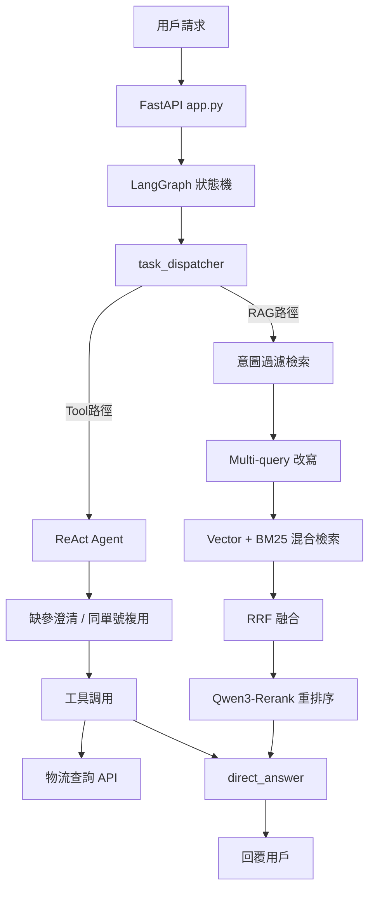
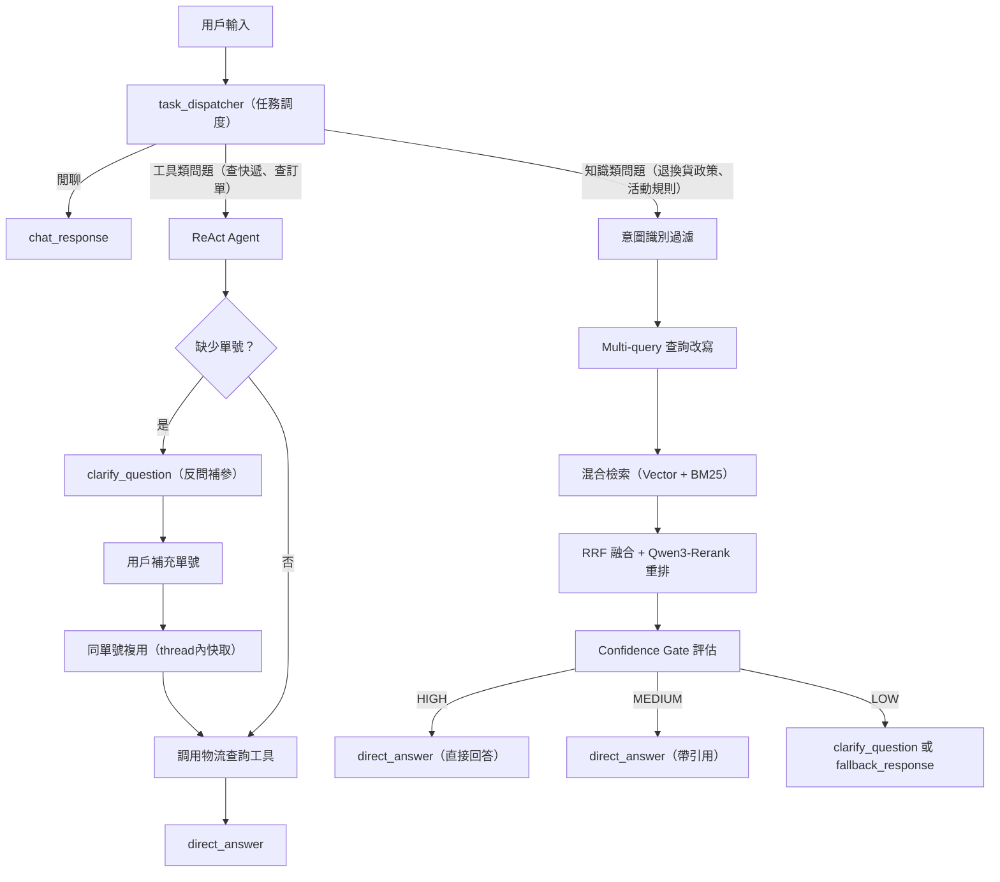

# 🫲😁🤖😁🫱 智能客服 Agent（基於 RAG + ReAct 技術）

> 基於 LangGraph + DeepSeek + 混合檢索 + ReAct Agent 的智能客服系統，支援有狀態工具調用、意圖識別、缺參澄清、多輪對話與流式回覆。

---

## 📖 目錄

- [專案簡介](#專案簡介)
- [系統架構](#系統架構)
- [對話流程](#對話流程)
- [技術棧](#技術棧)
- [快速開始](#快速開始)
- [API 文件](#api-文件)
- [檢索策略評測](#檢索策略評測)
- [置信度門控（Confidence Gate）](#置信度門控confidence-gate)
- [專案結構](#專案結構)
- [常見問題](#常見問題)

---

## 專案簡介

本系統是一個以 RAG + ReAct Agent 為雙核心的智能客服系統，主要特色包括：

- **有狀態 ReAct Agent**：基於 LangGraph 實現工具調用循環，支援思考→工具調用→觀察→繼續推理的完整 ReAct 鏈路
- **Agent Tool 體系**：內建物流查詢工具，支援同一對話內單號複用，避免重複詢問
- **缺參澄清機制**：當用戶查詢缺少必要參數（如快遞單號）時，Agent 自動發起澄清問題，等待補全後再執行工具
- **Tool / RAG 智能分流**：任務調度器（`task_dispatcher`）根據問題類型自動選擇走工具調用鏈路還是知識庫檢索鏈路
- **多策略混合檢索**：向量搜索（Milvus）+ 全文搜索（Elasticsearch BM25）+ 重排序（Qwen3-Rerank）
- **Confidence Gate 置信度門控**：基於滑動窗口 + P25/P75 動態閾值，對每條查詢打 HIGH/MEDIUM/LOW 標籤，驅動差異化後處理策略
- **意圖過濾**：在檢索前進行意圖識別，縮小檢索範圍，顯著提升精準度
- **流式回覆**：支援 SSE 流式輸出，全節點（包含澄清節點）均已接入流式鏈路

---

## 系統架構



---

## 對話流程

---

## 技術棧

| 技術 / 框架 | 版本 | 用途 |
|------------|------|------|
| LangGraph | latest | 狀態機，管理 Agent 對話流程節點與工具循環 |
| LangChain | latest | LLM 應用框架，工具封裝 |
| DeepSeek | deepseek-chat | 大語言模型，負責推理與生成 |
| DashScope | text-embedding-v2 | 向量嵌入模型 |
| Qwen3-Rerank | latest | 重排序模型，提升檢索精準度 |
| Milvus | 2.3.0+ | 向量數據庫，存儲與檢索 FAQ 向量 |
| Elasticsearch | 8.0+ | 全文搜索引擎，執行 BM25 檢索 |
| MySQL | 8.0+ | 存儲結構化 FAQ 資料 |
| FastAPI | 0.100+ | HTTP API 服務 |
| Uvicorn | 0.20+ | ASGI 服務器 |

---

## 快速開始

### 前置需求

- Python 3.10+
- Docker & Docker Compose
- DeepSeek API Key（[申請地址](https://platform.deepseek.com/)）
- DashScope API Key（[申請地址](https://dashscope.aliyun.com/)）

### 1. 克隆專案

```bash
git clone https://github.com/BlackerSake/rag_project.git
cd rag_project
```

### 2. 安裝依賴

```bash
pip install -r requirements.txt
```

### 3. 配置環境變數

在專案根目錄建立 `.env` 文件：

```env
# DeepSeek API
deepseek_api_key="your-deepseek-api-key"
deepseek_model_id="deepseek-chat"
deepseek_base_url="https://api.deepseek.com"

# DashScope 嵌入模型
dashscope_api_key="your-dashscope-api-key"
dashscope_model_id="text-embedding-v2"

# Milvus 向量庫
MILVUS_URI="http://localhost:19530"
MILVUS_COLLECTION_NAME="customer_service"

# Elasticsearch
ES_URL="http://localhost:9200"
ES_INDEX_NAME="customer_service"

# MySQL
MYSQL_HOST="127.0.0.1"
MYSQL_PORT="3306"
MYSQL_USER="root"
MYSQL_PASSWORD="your-mysql-password"
MYSQL_DATABASE="customer_service_db"

# 初始化配置
INIT_BATCH_SIZE="100"
INIT_RETRY_ATTEMPTS="3"
INIT_RETRY_INTERVAL_SECONDS="2"
INIT_FORCE_VECTOR_REIMPORT="false"
INIT_SKIP_VECTOR_IMPORT="false"

# 應用配置
APP_HOST="0.0.0.0"
APP_PORT="8000"
```

### 4. 啟動基礎服務（Milvus + Elasticsearch）

```bash
docker compose up -d

# 確認服務正常運行
docker compose ps
```

> 首次啟動 Milvus 需要約 30 秒完成初始化，請等待所有服務狀態變為 `healthy`。

### 5. 初始化知識庫

將 FAQ 文件放入 `data/documents/` 目錄後，執行：

```bash
python init.py
```

`init.py` 會自動完成：FAQ 資料校驗、意圖樹同步、MySQL FAQ 表同步、向量數據導入 Milvus、全文索引導入 Elasticsearch。

如需單獨執行各步驟：

```bash
python scripts/insert_faq.py                        # 插入 FAQ
python scripts/from_mysql_import_faq_to_milvus.py   # 同步向量庫
python scripts/check_knowledge_base.py              # 健康檢查
```

### 6. 啟動應用

```bash
uvicorn app:app --reload
```

應用將在 `http://localhost:8000` 運行，瀏覽器打開即可訪問內置聊天介面。

---

## API 文件

啟動後可訪問 Swagger UI：`http://localhost:8000/docs`

### POST `/chat` — 普通對話

**請求體：**

```json
{
  "message": "幫我查一下快遞到哪了",
  "thread_id": "user_123"
}
```

**回應（工具調用場景 — 缺少單號，Agent 主動澄清）：**

```json
{
  "response": "請提供您的快遞單號，我來幫您查詢物流狀態。",
  "topic": "物流查詢",
  "thread_id": "user_123"
}
```

**回應（知識庫場景）：**

```json
{
  "response": "您好！我們支援七天無理由退貨，退款將在確認收貨後 3 個工作日內原路退回。",
  "topic": "退換貨",
  "thread_id": "user_123"
}
```

| 字段 | 類型 | 說明 |
|------|------|------|
| `message` | string | 用戶輸入內容 |
| `thread_id` | string | 對話線程 ID，用於多輪上下文管理與工具參數複用，預設為 `"default"` |

---

### POST `/chat/stream` — 流式對話（SSE）

與 `/chat` 請求體相同，以 SSE 方式流式回傳。

**回應格式：**

```
data: 您好！

data: 我們的退換貨政策如下：...

data: [DONE]
```

**節點白名單**：僅 `direct_answer`、`clarify_question`、`fallback_response`、`chat_response` 四個輸出節點的 token 透傳至前端，Agent 內部推理過程不洩漏。`clarify_question` 節點已完整接入流式鏈路，澄清問題與正常回答均逐字推送。

收到 `data: [DONE]` 表示本次回覆結束。

---

### GET `/health` — 健康檢查

```json
{ "status": "healthy" }
```

---

## 檢索策略評測

> 測試集：120 條 FAQ 問答對；重排序模型：Qwen3-Rerank；RRF 參數：k=60，向量:BM25 = 1:1

| 方法 | Recall@3 | MRR | NDCG@3 | Precision@3 | Hit Rate@3 | 延遲 (ms) |
|------|----------|-----|--------|-------------|------------|----------|
| Vector | 0.8111 | 0.8806 | 0.8176 | 0.3833 | 0.9000 | 503.75 |
| BM25 | 0.5681 | 0.7000 | 0.5969 | 0.2333 | 0.7000 | **9.70** |
| Hybrid | 0.8083 | 0.8833 | 0.8156 | 0.3806 | 0.9083 | 399.81 |
| Hybrid + Rerank | 0.8111 | 0.9083 | 0.8253 | 0.3750 | 0.9250 | 2416.75 |
| Multi-query + Rerank | 0.8139 | 0.9069 | 0.8266 | 0.3778 | 0.9250 | 1254.80 |
| **intent_filtered** | **0.8364** | **0.9404** | **0.8540** | **0.3945** | **0.9541** | 763.40 |

**主要結論：**

- 純 BM25 速度最快（9.7ms）但召回率最低（Hit Rate@3 僅 0.70）
- `intent_filtered` 在全部指標上均最優，以 763ms 的中等延遲換取 0.9541 Hit Rate@3
- Rerank 顯著提升 MRR，但 `Hybrid + Rerank` 延遲高達 2416ms；`intent_filtered` 在 Rerank 前先通過意圖縮小候選集，將延遲壓至三分之一

---

## 置信度門控（Confidence Gate）

Confidence Gate 是一道在檢索之後、生成之前的動態過濾層，評估當前查詢的檢索置信度，輸出 `HIGH / MEDIUM / LOW` 標籤，驅動差異化的後處理策略（直接回答 / 澄清 / 降級兜底）。

### 工作原理

採用**滑動窗口（大小 = 100）+ P25/P75 動態閾值**，避免使用固定閾值帶來的分佈偏移問題。目前支援兩種信號源：

- **ABSOLUTE**：以向量相似度絕對值作為 score，計算輕量
- **MARGIN**：以 Top-1 與 Top-2 分數之差（margin）作為 score，差距越大代表 Top-1 越突出，置信度越高

### 離線評測結果（測試集 120 條，窗口大小 100）

**ABSOLUTE 信號源（平均延遲 352.56 ms）**

| 置信度等級 | 查詢數 | 平均 Recall@3 |
|-----------|--------|--------------|
| HIGH | 21 條 | 0.8333 |
| MEDIUM | 54 條 | **0.8827** |
| LOW | 45 條 | 0.7148 |

**MARGIN 信號源（平均延遲 926.26 ms）**

| 置信度等級 | 查詢數 | 平均 Recall@3 |
|-----------|--------|--------------|
| HIGH | 37 條 | **0.9189** |
| MEDIUM | 50 條 | 0.8767 |
| LOW | 33 條 | 0.5909 |

### 關鍵結論

- **MARGIN HIGH 組 Recall@3 高達 0.9189**，比 ABSOLUTE HIGH 組高出約 8.5 個百分點，說明 margin 是區分力更強的置信度指標
- MARGIN LOW 組 Recall@3 僅 0.5909（比 ABSOLUTE 低 12.4 個百分點），說明 MARGIN 的分層更為極端：對高置信查詢更自信，對模糊查詢更保守——更適合「HIGH 直接回答 / LOW 轉人工或兜底」的差異化策略
- 延遲代價：MARGIN 信號源比 ABSOLUTE 多消耗約 573ms，可根據業務對準確率與延遲的取捨選擇

---

## 專案結構

```
rag_project/
├── app.py                  # FastAPI 主應用，定義 /chat、/chat/stream、/health 接口
├── state_machine.py        # LangGraph 入口，run_chat / run_chat_stream
├── init.py                 # 一鍵初始化：FAQ 校驗、MySQL、Milvus、ES 同步
├── docker-compose.yml      # Milvus + Elasticsearch 容器配置
├── faq_data.json           # FAQ 原始資料
├── pytest.ini              # pytest 配置
├── requirements.in         # 依賴源文件
├── requirements.txt        # 鎖定版本依賴
│
├── core/                   # 核心邏輯
│   ├── __init__.py         # 導出 State、compiled_graph、model
│   ├── state.py            # LangGraph State 定義（messages、current_topic、tool_cache 等）
│   ├── nodes.py            # 各對話節點：task_dispatcher、ReAct Agent、direct_answer、clarify_question、fallback_response、chat_response
│   ├── models.py           # LLM / Embedding 模型初始化
│   └── intent_manager.py   # 意圖樹管理，從 intents.yaml 載入
│
├── data/
│   ├── knowledge_base.py   # 混合檢索封裝（Milvus + ES + RRF + Rerank + Confidence Gate）
│   └── documents/          # 知識庫文件（放置 FAQ 原始文檔）
│
├── config/
│   └── intents.yaml        # 意圖樹配置（業務意圖定義）
│
├── tools/                  # Agent 工具定義
│   └── logistics.py        # 物流查詢工具（支援缺參澄清、同單號複用）
│
├── utils/
│   └── logging_config.py   # 日誌配置
│
├── scripts/                # 獨立初始化腳本
│   ├── insert_faq.py
│   ├── from_mysql_import_faq_to_milvus.py
│   └── check_knowledge_base.py
│
├── evaluation/             # 評測腳本（含 Confidence Gate 離線評測）
├── tests/                  # 單元測試 / 集成測試
├── static/                 # 前端靜態資源
└── templates/
    └── index.html          # 內置聊天頁面
```

---

## 常見問題

**Q：啟動後訪問 `/chat` 返回 500 錯誤？**

請先確認以下服務已正常啟動：
```bash
docker compose ps        # Milvus 和 ES 應為 healthy
python init.py           # 確認知識庫已初始化
```

**Q：問物流時 Agent 一直重複詢問單號，不記得我已說過？**

請確認請求中的 `thread_id` 在整個對話 session 內保持一致。Agent 的同單號複用是基於 `thread_id` 在 LangGraph State 中快取的，每次請求換用新 `thread_id` 會導致狀態丟失。

**Q：如何更換 FAQ 資料？**

修改 `faq_data.json` 或在 `data/documents/` 放入新文件後，重新執行：
```bash
python init.py
```
如需強制重新導入向量，將 `.env` 中 `INIT_FORCE_VECTOR_REIMPORT` 設為 `true`。

**Q：流式接口的澄清問題也能流式輸出嗎？**

可以。`clarify_question` 節點已加入流式白名單，澄清問題與正常回答均逐字推送，不會因為走了 Agent 分支而降級為阻塞式回覆。

**Q：如何停止 Docker 服務？**

```bash
docker compose down
```

---

## License

MIT License — 詳見 [LICENSE](./LICENSE) 文件。(然無)