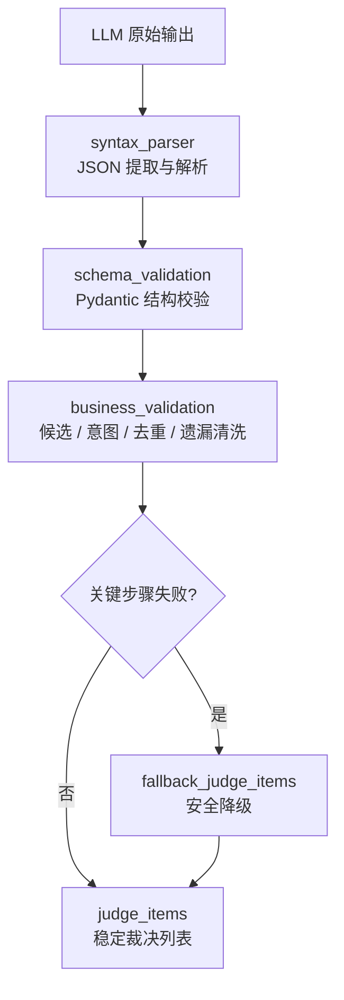
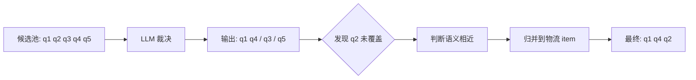
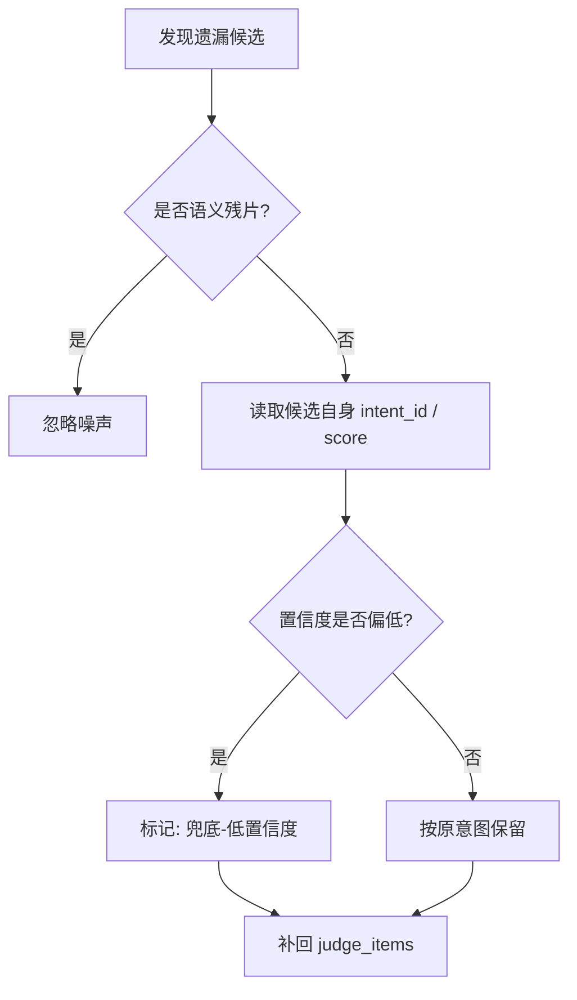
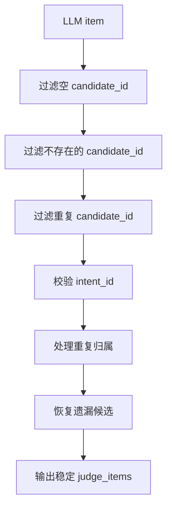

# 🧩 Structured Output 模块 — 裁决结果稳定化效果展示

> [!abstract] 文档说明
> 本文件基于 `app.log` 实际运行日志整理，聚焦说明 **`structured_output` 如何把 LLM 不稳定文本输出，转成后续节点可直接消费的稳定结构**。

---

## 📖目录

- [🧩 Structured Output 模块 — 裁决结果稳定化效果展示](#-structured-output-模块--裁决结果稳定化效果展示)
  - [📖目录](#目录)
  - [一、模块定位](#一模块定位)
    - [1.1 它解决什么问题？](#11-它解决什么问题)
  - [二、完整链路](#二完整链路)
    - [2.1 对外入口](#21-对外入口)
  - [三、实际运行：一次成功裁决](#三实际运行一次成功裁决)
    - [3.1 前后变化](#31-前后变化)
  - [四、关键效果一：遗漏候选不会静默丢失](#四关键效果一遗漏候选不会静默丢失)
  - [五、关键效果二：空裁决也能补回](#五关键效果二空裁决也能补回)
    - [5.1 补回策略](#51-补回策略)
  - [六、关键效果三：修格式，不篡改业务判断](#六关键效果三修格式不篡改业务判断)
  - [七、最终输出长什么样](#七最终输出长什么样)
  - [八、业务校验规则](#八业务校验规则)
    - [8.1 校验顺序](#81-校验顺序)
    - [8.2 规则压缩版](#82-规则压缩版)
  - [九、失败时的最终保证](#九失败时的最终保证)
  - [十、模块文件职责](#十模块文件职责)
  - [十一、边界说明](#十一边界说明)
  - [十二、效果总结](#十二效果总结)

---

## 一、模块定位

> [!quote] 一句话结论
> `structured_output` 不是为了让 LLM 永远判断正确，而是为了让 **LLM 输出即使不完美，系统也能拿到稳定、可信、不丢用户信息的数据结构**。

### 1.1 它解决什么问题？

| 风险 | LLM 可能怎么犯错 | 模块如何兜住 |
|---|---|---|
| 格式漂移 | 输出 Markdown 包裹、解释文字、半截 JSON | 提取 JSON → 本地修复 → 必要时 LLM 修复 |
| 结构漂移 | 字段类型不稳定、数组/字符串混用 | Pydantic 校验并归一化 |
| 幻觉污染 | 编出不存在的 `q99` 或未知 `intent_id` | 过滤未知候选与未知意图 |
| 重复归属 | 一个候选被分到多个 item | 保留首次有效归属 |
| 信息丢失 | 漏掉候选池里的某个子问题 | 语义归并或防御性补回 |
| 链路失败 | 空输出、坏 JSON、无有效 item | fallback：逐个候选保留 |

> [!success] 最终保证
> 后续节点拿到的不是“看起来像 JSON 的文本”，而是：
> - **可解析**：语法层面能被程序读取
> - **可信**：候选 ID 和意图 ID 都经过校验
> - **不丢信息**：用户原始候选不会被静默吞掉

---

## 二、完整链路



### 2.1 对外入口

| 入口 | 作用 | 适用场景 |
|---|---|---|
| `parse_and_validate_judge_output` | 同步解析裁决输出 | 本地修复即可完成 |
| `parse_and_validate_judge_output_async` | 异步解析裁决输出 | 本地修复失败后可请求 LLM 修复 |
| `sanitize_judge_items` | 业务清洗裁决项 | 候选恢复、去重、意图校验 |
| `fallback_judge_items` | 最终兜底 | 解析或清洗整体失败时保底输出 |

---

## 三、实际运行：一次成功裁决

> [!example] 日志切片：21:44:05
> 用户一句话里混合了物流查询、退款咨询和退款时效。系统先拆成 5 个候选，再交给 LLM 裁决，最终清洗成 3 个有效 item。

```log
21:44:05 core.structured_output.workflow INFO
  阶段=完整链路(workflow) 状态=开始(start)
  流程=query_decomposition_judge 原始输出字符数=322 候选数=5

21:44:05 core.structured_output.workflow INFO
  阶段=语法解析(syntax_parser) 状态=成功(success) 顶层类型=dict

21:44:05 core.structured_output.workflow INFO
  阶段=结构校验(schema_validation) 状态=成功(success) 有效项数=3

21:44:05 core.structured_output.validators INFO
  业务校验｜遗漏候选已归并｜候选ID=q2
  归并后候选=['q1', 'q4', 'q2']

21:44:05 core.structured_output.workflow INFO
  阶段=完整链路(workflow) 状态=成功(success) 有效项数=3
```

### 3.1 前后变化

| 阶段 | 结果 |
|---|---|
| 候选池 | 5 个候选问题 |
| LLM 原始裁决 | 3 个 item，但漏掉 `q2` |
| 语法解析 | 成功解析为 `dict` |
| Schema 校验 | 成功转为 `JudgeOutputSchema` |
| 业务校验 | 将遗漏的 `q2` 归并回物流 item |
| 后续节点 | 使用稳定 `judge_items` 继续改写、检索、路由 |

> [!tip] 关键点
> LLM 漏掉了 `q2`，但系统没有把它丢掉，而是把它归并进 `['q1', 'q4']` 对应的物流查询 item，最终变成 `['q1', 'q4', 'q2']`。

---

## 四、关键效果一：遗漏候选不会静默丢失



> [!note] 日志证据
> `q2` 没有出现在 LLM 原始裁决中，但业务校验阶段识别到遗漏，并归并到已有候选组。

| 风险 | 处理结果 |
|---|---|
| LLM 忘了某个候选 | 不直接丢弃 |
| 遗漏候选与已有 item 同主题 | 自动归并 |
| 后续检索缺少子问题 | 通过归并继续进入流程 |

---

## 五、关键效果二：空裁决也能补回

> [!warning] 日志切片：21:55:53
> LLM 原始输出只有 `{"items":[]}`，几乎没有业务价值。但候选池里还有 `q1`，因此业务校验触发防御性兜底。

```log
21:55:53 core.nodes INFO
  LLM查询拆解裁决原始输出: {"items":[]}

21:55:53 core.structured_output.workflow INFO
  阶段=完整链路(workflow) 状态=开始(start)
  原始输出字符数=12 候选数=1

21:55:53 core.structured_output.workflow INFO
  阶段=结构校验(schema_validation) 状态=成功(success)
  有效项数=0

21:55:53 core.structured_output.validators WARNING
  业务校验｜遗漏候选使用防御性兜底
  候选ID=q1 意图=B3 原因=兜底-低置信度

21:55:53 core.nodes INFO
  LLM查询拆解裁决完成:
  [{'candidate_ids': ['q1'], 'intent_id': 'B3', 'reason': '兜底-低置信度'}]
```

### 5.1 补回策略



| 场景 | 输出策略 |
|---|---|
| `{"items": []}` | 不让候选消失，尝试补回 |
| 候选自带有效意图 | 沿用候选意图 |
| 置信度偏低 | 保留，同时标记 `兜底-低置信度` |
| 候选只是“嗯”“好的”“这个” | 过滤，避免噪声进入检索 |

---

## 六、关键效果三：修格式，不篡改业务判断

> [!important] 修复边界
> 格式修复只负责让 JSON 可解析、字段可校验；不重新判断用户真实意图。

| 修复层 | 处理内容 | 是否改业务语义 |
|---|---|:---:|
| 本地修复 | 剥离 Markdown、提取 JSON、删除尾随逗号 | ❌ |
| LLM 修复 | 修复 JSON 语法、字段类型 | ❌ |
| 业务校验 | 过滤未知 ID、去重、恢复遗漏候选 | ✅ 只做规则化清洗 |

````text
原始输出：
下面是结果：
```json
{
  "items": [
    {"candidate_ids": ["q1"], "intent_id": "A3", "reason": "物流查询",}
  ],
}
```

修复后：
{
  "items": [
    {"candidate_ids": ["q1"], "intent_id": "A3", "reason": "物流查询"}
  ]
}
````

---

## 七、最终输出长什么样

```json
[
  {
    "candidate_ids": ["q1", "q4", "q2"],
    "intent_id": "A3",
    "reason": "同一单号物流查询，合并；遗漏归并"
  },
  {
    "candidate_ids": ["q3"],
    "intent_id": "A1",
    "reason": "订单1212312356退货咨询"
  },
  {
    "candidate_ids": ["q5"],
    "intent_id": "A1",
    "reason": "退款时效咨询"
  }
]
```

| 字段 | 含义 | 保障 |
|---|---|---|
| `candidate_ids` | 被保留、合并或补回的候选问题 ID | 必须来自真实候选池 |
| `intent_id` | 最终裁决意图 | 必须存在于真实意图目录 |
| `reason` | 裁决原因或清洗标记 | 可追加 `遗漏归并` / `兜底-低置信度` |

---

## 八、业务校验规则

### 8.1 校验顺序



### 8.2 规则压缩版

| 规则 | 做法 | 收益 |
|---|---|---|
| 候选 ID 校验 | 只保留候选池中真实存在的 ID | 防止幻觉候选污染后续流程 |
| 意图 ID 校验 | `intent_id` 必须在 `valid_intent_ids` 中 | 防止路由到不存在分支 |
| 重复归属处理 | 同一候选只保留首次有效归属 | 避免重复回答 |
| 遗漏候选恢复 | 先归并，归并不了再补回 | 尽量不丢用户诉求 |
| 语义残片过滤 | “嗯 / 好的 / 这个”等可忽略 | 降低噪声进入检索 |

---

## 九、失败时的最终保证

> [!failure] 最坏情况
> 解析失败、修复失败、Schema 校验失败、业务清洗失败，都不能让链路直接“空掉”。

最终兜底结构：

```json
[
  {
    "candidate_ids": ["q1"],
    "intent_id": "A3",
    "reason": "规则兜底保留"
  },
  {
    "candidate_ids": ["q2"],
    "intent_id": "B3",
    "reason": "规则兜底保留"
  }
]
```

| 兜底原则 | 说明 |
|---|---|
| 不静默失败 | 链路失败也返回可用列表 |
| 不丢候选 | 每个有效候选独立保留 |
| 优先用原意图 | 候选自带 `intent_id` 时沿用 |
| 缺意图用默认值 | 默认 `D2`，可通过配置覆盖 |

---

## 十、模块文件职责

| 文件 | 职责 |
|---|---|
| `__init__.py` | 对外统一导出入口 |
| `parser.py` | 从 LLM 原文中提取并解析 JSON |
| `schemas.py` | 定义 Pydantic 输出结构 |
| `validators.py` | 业务校验、清洗、去重、遗漏恢复 |
| `repair.py` | 本地格式修复与 LLM 格式修复 |
| `fallbacks.py` | 裁决、改写、结构化状态的安全降级 |
| `workflow.py` | 串联解析、修复、校验、兜底，并输出分层日志 |


---

## 十一、边界说明

> [!success] 日志可以证明
> - `workflow → syntax_parser → schema_validation → business_validation` 链路正常执行
> - LLM 漏候选时，模块能把遗漏候选归并回来
> - LLM 输出空 item 时，模块能防御性补回候选
> - 输出结果能被后续 `llm_rewrite`、检索、路由节点继续消费
> - 日志能定位失败发生在语法、结构、业务还是兜底阶段

> [!failure] 日志不能证明
> - 所有格式错误都一定能修复
> - LLM 的业务裁决永远正确
> - 复杂跨轮状态一定不会冲突
> - 未知意图体系变更后的兼容性

> [!tip] 准确定位
> 该模块是 **LLM 输出稳定化层**，不是意图识别模型本身，也不是业务规则引擎本身。

---

## 十二、效果总结

> [!done] 核心价值
> 把“LLM 大概率正确的文本输出”，变成“后续代码可以稳定依赖的数据结构”。

当前实际具备的效果：

- Markdown / 解释文字 / 小 JSON 错误不会轻易打断链路
- 幻觉候选、未知意图会被过滤
- 重复归属会被去重
- 漏候选会被归并或补回
- 空裁决不会导致用户问题静默丢失
- 全链路日志可观测、可定位、可复盘

---

*基于 [`app.log`](../summary/app.log) 整理 · 时间范围 2026-05-11 21:41–22:07*
